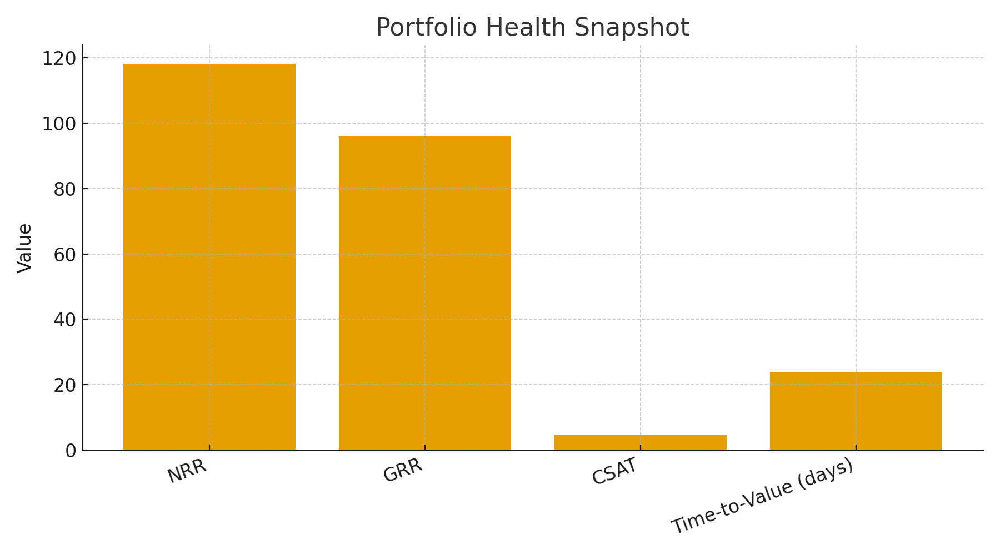

# ben-breaux-works

A portfolio of **Customer Success** and **Technical Account Management** dashboards by **Ben Breaux**.  

📊 Focus: adoption, retention, executive-ready visuals, and public sector outcomes.  
🛠 Tech: Python (pandas, matplotlib), Tableau-style reporting, SQL, ArcGIS, Excel.  
⚡ All data is mock/anonymized for demonstration.  

---

## 📈 Adoption Metrics (Customer Success)
Visualizes **month-over-month active usage (% of licenses)** to track adoption and time-to-value.  
Great for QBRs and executive updates.  

  

---

## 📊 Portfolio Health Snapshot
Executive view of **NRR, GRR, CSAT, and Time-to-Value** in one chart.  
Used to monitor overall account health and renewal readiness.  

  

---

## 🏛️ Public Sector Outcomes (pinyin)
Shows **before/after results** of a state mental health program revamp, with labels in **Chinese pinyin**.  
Demonstrates how technical dashboards can communicate outcomes for public institutions.  

  

---

## 🔗 Repo Structure
- `dashboards/` → Python scripts that generate dashboards  
- `data/` → Sample CSVs  
- `screenshots/` → Ready-to-use PNGs  
- `index.html` → Clean gallery view for GitHub Pages  

---

## 🌐 Live Gallery
👉 [GitHub Pages Preview](https://tiredofthissong.github.io/ben-breaux-works/)  

---

💡 Each dashboard is designed for a **single-plot, quick insight**—ideal for QBRs, executive reviews, and implementation updates.  
